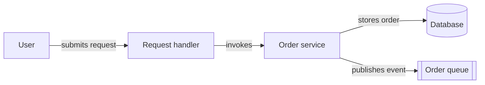
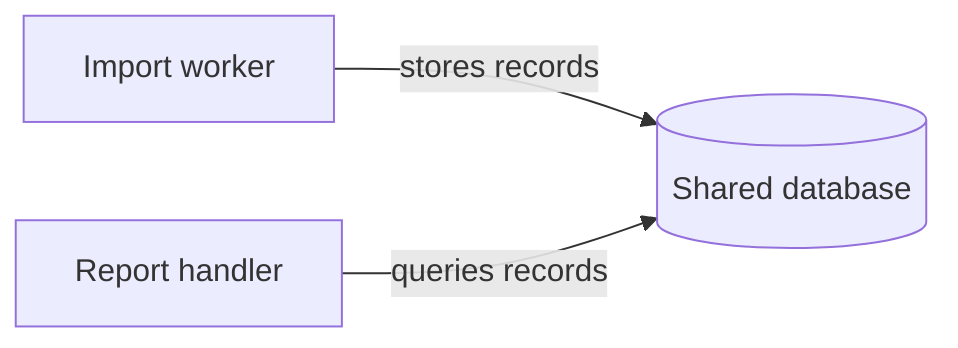
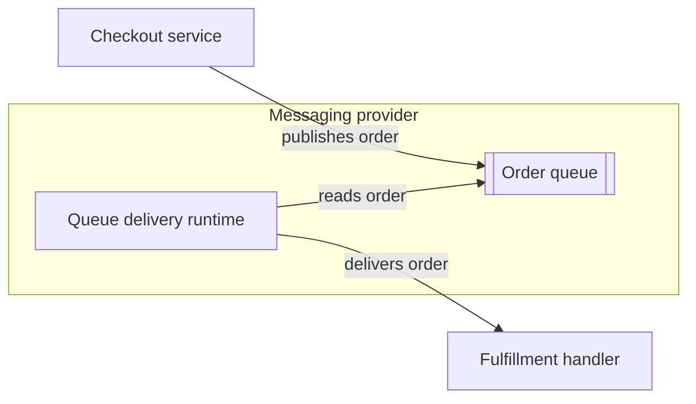
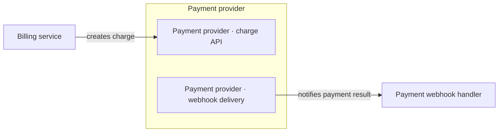
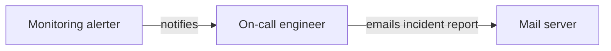
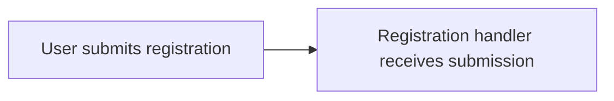

# Action flow

An action flow is a purpose-curated diagram in which every semantic arrow represents a **one-way action initiated by its source toward its target**.

The core invariant is agency. A useful check is whether each semantic edge can be read as **source VERBS TOWARD target**.

## When to use it

Use an action flow to explain who or what acts on whom around a selected behavior or concern. Participants may include people, code elements, services, schedulers, workers, infrastructure mechanisms, and external providers.

Select only the participants and actions needed to answer the diagram's question. Use subgraphs, labels, or styling for useful system, ownership, deployment, or containment boundaries.

Action flow is broader than a call graph but more constrained than a general architecture diagram. Dependencies, ownership, containment, implementation, and other structural relations are not action edges.

Show only the initiating or request direction. Omit responses, return values, acknowledgements, and return journeys. Represent webhooks, callbacks, and deliveries as new initiations from their actual sources.

## Construction guidance

Start with the behavior or question being explained, then choose an editorial resolution and the participants relevant to it. For each action, identify its actual initiator and target. Draw the action in that direction and label it with a concrete verb such as `invokes`, `queries`, `stores`, `publishes`, `delivers`, or `notifies`.

Review the result for responses, structural relations, and passive-resource relays that do not belong. When an infrastructure node would otherwise appear to initiate an action, show the actual active mechanism at a resolution useful to the diagram.

Treat participants as active or passive for the behavior and editorial resolution being shown.

## Preserve agency

Passive resources may receive actions but must not masquerade as actors or relay causality. Do not use `process A --> database --> process B` to imply that storage initiated the second process.

Represent separately initiated access instead:

Apply the same rule to queues, files, state, collections, payloads, and screens.

When infrastructure initiates behavior, show the active mechanism at a useful resolution:

When useful, distinguish an external system's passive endpoint from the process that initiates a later action:

Genuine active chains are valid when every source initiates the next action:

## Labels and alignment

Label semantic edges by default. An unlabeled edge is acceptable only when the diagram declares one default action for its edge family or unmistakable endpoint wording supplies the action:

If more than one verb is plausible, add a label.

`A ~~~ B` is a layout-only, non-semantic alignment edge.

## Grounding and resolution

Prefer participants anchored in named code elements, runtime mechanisms, people, external actors, or faithful aggregations with discoverable implementation boundaries. Conceptual participants can earn their place when they clarify the selected concern without obscuring where behavior lives or absorbing unrelated behavior.

Ask: “What concrete implementation, runtime process, person, or external system anchors this participant and its attributed behavior?”

Keep a coarse participant when its internal handoffs are irrelevant; decompose it when finer, grounded roles improve the explanation. Cycles are valid when they truthfully expose interaction. Do not let layout dictate action direction, and do not decompose participants solely to make the graph acyclic.

## Common failure modes

Use these as diagnostic examples rather than an exhaustive checklist.

| Failure | Symptom | Correction |
|---|---|---|
| Passive relay | `process A --> database --> process B` | Draw each independently initiated resource access |
| Hidden mechanism | `queue --> consumer` | Name the delivery runtime or polling worker |
| Structural edge | `service -->\|depends on\| library` | Use boundaries, styling, or another archetype |
| Return journey | Paired request and response arrows | Keep only initiation direction |
| Vague agency | `Platform` or `System` performs unrelated actions | Ground or decompose the participant |
| Layout-driven direction | An arrow points opposite the real action | Preserve agency; use `~~~` or restructure |
| Ambiguous unlabeled edge | The reader must guess the verb | Add an action label or declare a default |

## Composition

Use the numbered-edges skill when selected actions need explicit steps, phases, or ordering; action flow alone makes no sequencing claim.

Use the multi-view skill when the same participants and actions should be shown under different lenses or states.

Choose the artifact-process-flow skill when durable information and the work that transforms it are the primary subject.

Composition does not change arrow agency: every semantic action arrow still points from the true initiator to its target.
