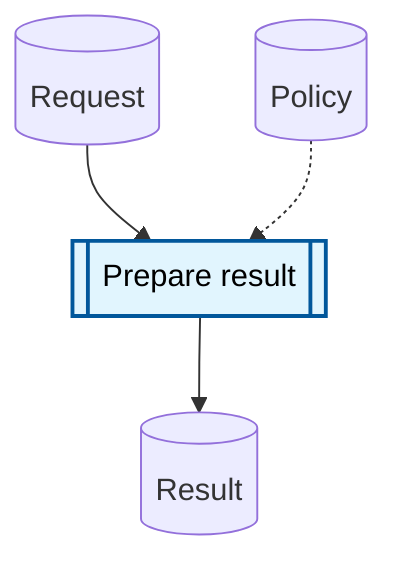

# Artifact-process flow

Use an artifact-process flow to show how processes consume or consult durable information and what they produce.

Artifact nodes represent durable information, whereas process nodes represent work that transforms information. Solid paths alternate between artifact and process nodes. A dotted edge means that a process consults an artifact without transforming it along the main path.

Repeat the same flow under different lenses with the multi-view skill, or add explicit order to selected interactions with the numbered-edges skill. Choose the action-flow skill when the diagram concerns who acts on whom rather than information transformed by work.
