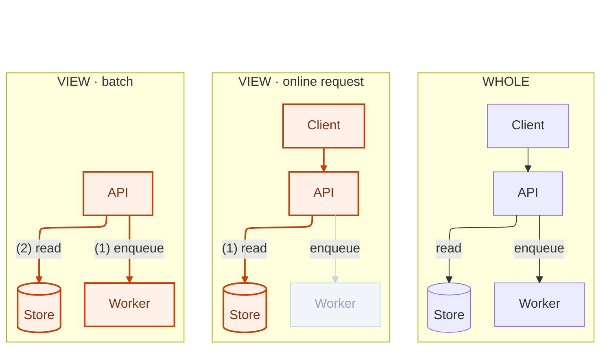

# Multi-view

Use multi-view to show what remains stable across two or more views and how each view selects, emphasizes, or changes parts of the shared graph.

Begin with one shared semantic graph that is the union of every element any view will show. Every view renders that same graph with the same nodes, edges, and boundaries; views differ only in styling. Color, stroke, and opacity are layout-neutral, while a label's presence and footprint are layout input, so keep every label present in every view and prefer recoloring a label to deleting its text. Each view names its lens and uses emphasis, de-emphasis, hiding, or status styling to communicate what that lens highlights or changes. An element outside a view's lens stays in the graph, styled hidden or grayed.

Forms include:

- a whole diagram followed by focused or partial views;
- before and after states;
- iterations, scenarios, operating modes, phases, or perspectives.

A focused view keeps the rest of the graph in gray for orientation. A partial view styles out-of-lens elements hidden. Before-and-after views render the same graph in both states: elements that will be added appear in the before view hidden or grayed, elements that will be removed appear in the after view grayed as obsolete, and unchanged elements keep identical styling. Show an ownership change by placing the element in both boundaries in every view, styling the losing copy obsolete and the gaining copy new.

With ELK or Dagre, connect an invisible root to each view with layout-only `~~~` links to guide view order without asserting semantic relationships between views.

Give an edge an ID (`a e1@-->|"label"| b`) when a view styles it, and apply the style with `class`. `linkStyle` indexes edges by declaration order across the whole document, so one inserted edge silently restyles the rest. Give edges their own classDefs; a node class's `fill:` leaks into the edge path. An edge that any view hides should stay unlabeled throughout — hiding blanks the label text but not its background.

Multi-view can repeat either an artifact-process flow or an action flow, authored with the artifact-process-flow or action-flow skill. Add the numbered-edges skill when a view also needs explicit interaction order; the same edge may carry a different number, or none, in each view.
