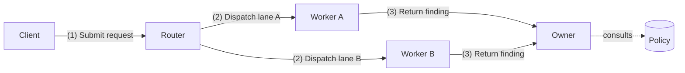

# Numbered edges

Use numbered edges to assign selected interactions to explicit steps or phases, or to show their order within a declared scope.

Prefix an edge label with an ordinal while preserving the edge's underlying meaning. Declare whether each numbering scope represents a total order, shared phases, a lane-local order, or a partial order. Within a scope, equal values mark a shared phase, while unnumbered edges remain outside the declared ordering. The `~~~` relation is layout-only and receives no number.

Numbered edges compose with the action-flow, artifact-process-flow, and multi-view skills.
