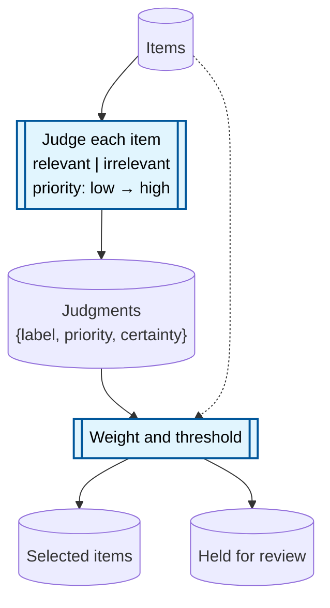

# Diagramming a system 1 machine

Draw the machine as an artifact-process flow: artifact nodes are durable information,
process nodes are work that transforms it, solid paths alternate between the two, and a
dotted edge means a process consults an artifact without transforming it. The
artifact-process-flow skill covers that topology and its node shapes in full.

Two conventions are specific to a system 1 machine.

**Say what each judgment decides, inside its node.** A judgment process is opaque unless
the diagram names the decision and the shape of the answer. Stack that under the label
with ` `, which is Mermaid's line break. Where the substrate is already chosen, use
its own vocabulary.

**Keep judgment and deterministic computation in separate nodes,** with the artifact
between them drawn explicitly. Collapsing them hides where fan-out, weighting, and
thresholds actually live.

A sketch of the shape, not a template to fill in:

The uncertain branch is worth drawing whenever the machine acts on judgments.
